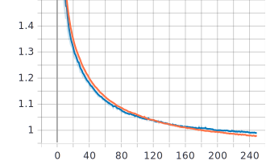
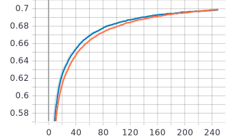

# Runescape Midinet: Runescape Music Generator
Runescape Midinet is deep learning model that has been trained with purpose of replicating the soundtrack from the MMORPG called Runescape. 
This project is heavily inspired by the works of [Music Transformer](https://magenta.tensorflow.org/music-transformer), an neural network that generates piano music. This project expands upon this to create a model that can utilize multiple instruments within a song.

Inside the inner workings of this model is an attention-based neural network that utilizes the memory efficient relative attention algorithm described by authors of Music Transformer. If you are interested in learning more about this, be sure to look at the [Music Transformer paper](https://arxiv.org/abs/1809.04281).

## Running on Google Colab

This model can be ran on Google Colab. To do so, simply upload the repository to your Google Drive. Then
open up `midinet_notebook.ipynb` in Google Colab and follow the instructions in the notebook.


## Installing Dependencies

Run the following command to install the required dependencies using pip:
```
    pip install tensorflow mido
```


## Trained Model

Midinet was trained on the [Lahk MIDI Dataset](https://colinraffel.com/projects/lmd/) for 250 epochs and then on the [Runescape OST](https://www.youtube.com/watch?v=lY4nX5e1ipA) (provided by Runescape Reorchestrated) for 50 epochs. 

The model had the following parameters (excluding the dataset):

```
{
    "vocab_size": 517,
    "embedding_size": 512,
    "sequence_length": 2048,
    "num_blocks": 6,
    "num_heads": 8,
    "feed_forward_dim": 1024,
    "dropout": 0.10,
    "learning_rate": 0.0001,
    "batch_size": 2,
    "dataset": ---
}
```

## Downloading the Trained Model
If you wish to skip the training process, then the trained model can be downloaded from releases found [here](https://github.com/Kipwisp/runescape-midinet/releases/download/1.0/midinet_model_trained.zip). After downloading, extract the contents of the zip to `midinet_model_trained` - then simply move it to the root directory of this project.

Make sure to change `parameters.json` to match the trained model parameters specified above if you are using this model for inference.

*(note: in order to use the model for inference, you still must download and preprocess a dataset)*

## Music Samples

A playlist containing music samples generated from the trained model can be found on [Soundcloud](https://soundcloud.com/kipwisp/sets/midinet-music-generator).


## Graphs
These graphs show the results from training the model for 250 epochs on the Lahk Dataset.

Key
* **Orange**: train loss and accuracy
* **Blue**: validation loss and accuracy

### Loss


### Accuracy



## Downloading the Datasets

Two datasets were used to train this model: the [Runescape OST](https://www.youtube.com/watch?v=lY4nX5e1ipA) and the [Lahk MIDI Dataset](https://colinraffel.com/projects/lmd/).

A script has been provided to automatically download and format these datasets. To download these datasets, simply
use the `download.py` script like shown below.
```
python download.py -d rs_ost -o rs_ost_raw
python download.py -d lahk -o lahk_raw
```

The `download.py` script takes in the following arguments:
* **--dataset (-d)**: the dataset to download (rs_ost or lahk)
* **--output (-o)**: the directory the dataset will be downloaded to

## Preprocessing the Datasets

Before training, these datasets must be preprocessed into a tokenized sequence.
We follow a similar strategy to the one proposed in Music Transformer but with an extra set of tokens that allows the model to change instruments:

* Tokens 0-127 represent a NOTE_ON message for each respective pitch (0-127)
* Tokens 128-255 represent a NOTE_OFF message for each respective pitch (0-127)
* Tokens 256-287 represent a change in velocity (0-127 with a step of 4)
* Tokens 288-387 represents a jump in time (10-1000 milliseconds with a step of 10)
* Tokens 388-515 represents a change in instrument (0-127)
* Token 516 is reserved as the padding token

Use `preprocess.py` to preprocess each dataset into these sequences of tokens like shown below.

*(note: this may take several hours depending on the size of the dataset)*
```
python preprocess.py -i rs_ost_raw -o rs_ost
python preprocess.py -i lahk_raw -o lahk
```

The `preprocess.py` script takes in the following arguments:
* **--input (-i)**: the directory containing the downloaded MIDIs
* **--output (-o)**: the directory to save the preprocessed dataset to

## Adjusting the Parameters
The parameters that controls the architecture of the model can be found in `parameters.json`.

The following parameters can be adjusted:
* **vocab_size**: the size of the vocabulary **(DO NOT CHANGE THIS)**
* **embedding_size**: the size of embedding layer
* **sequence_length**: the length of the input sequence
* **num_blocks**: the number of decoder blocks
* **num_heads**: the number of attention heads
* **feed_forward_dim**: the dimension size for the feed forward layers
* **dropout**: the dropout rate
* **learning_rate**: the learning rate
* **batch_size**: the batch size used during training
* **dataset**: the dataset that will be used for training and inference


## Training
To begin training the model simply run the `train.py` script. TensorBoard graphs to track loss and accuracy can be under `logs`. After training is finished, the model will be saved to the directory specified by `save_directory`.

```
python train.py -e 5 -s midinet_model
```

The `train.py` script takes in the following arguments:
* **--epochs (-e)**: number of epochs to train the model for
* **--save_directory (-s)**: the directory the model will be saved to
* **--restore****: will restore from the latest checkpoint if given as an argument

## Inference
After training, we can use the model for inference to generate MIDI music.

The model will be given random samples from the dataset specified in `parameters.json` as the seed to begin inference with. If you wish to draw samples from a different dataset for inference, simply change the dataset parameter in `parameters.json`.

To generate some music, simply run the `generate.py` script like shown below. The model that will be used for inference is specified by `save_directory`.

After it finishes, the generated MIDI will be saved under the `output` directory.

(note: make sure the sequence length specified in model parameters matches the sequence length for the model being used)

```
python generate.py -l 2500 -k 8 -s midinet_model
```

If you downloaded the trained model, then you will most likely want to use the command below instead assuming you moved the downloaded model directory to the project root folder and named it `midinet_model_trained`.
```
python generate.py -l 2500 -k 8 -s midinet_model_trained
```

The `generate.py` script takes in the following arguments:
* **length (l)**: the number of song tokens to be generated
* **top_k (k)**: the k value for selecting top k predictions
* **save_directory (s)**: the directory to load the saved model from
* **inclusive**: will include the seed as part of the generated MIDI when given as an argument

  
## Dependencies
* [Tensorflow](https://www.tensorflow.org/)
* [Mido](https://github.com/mido/mido)

## Acknowledgements
These projects and articles helped contribute to the making of this project:
* https://magenta.tensorflow.org/music-transformer
* https://github.com/jason9693/MusicTransformer-tensorflow2.0
* https://towardsdatascience.com/jazz-music-generation-using-gpt-a7ed52b0f468
  
## Licensing
This project is licensed under the GNU GPLv3 - see [LICENSE](https://raw.githubusercontent.com/Kipwisp/runescape-midinet/master/LICENSE?token=AOSFA3FAWB7PA6Q2QHBF753ATHMFO) for details.
